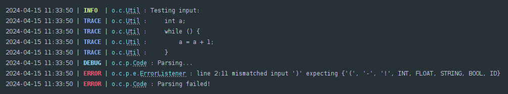
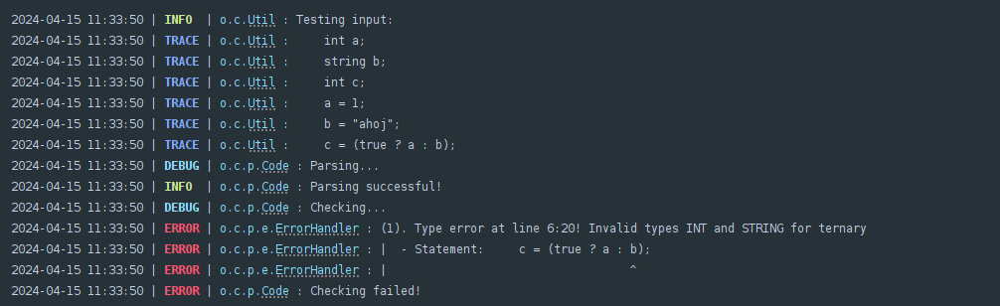
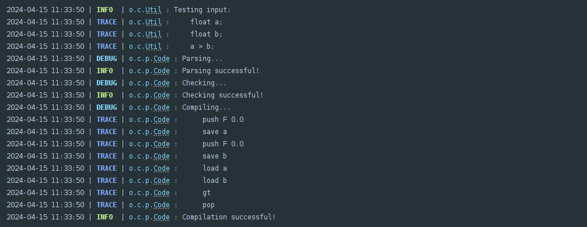
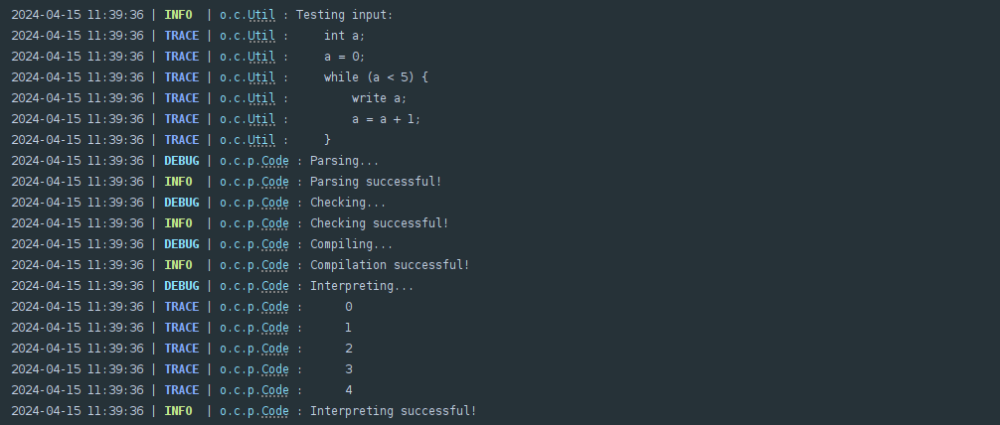

# Code-Composer

Code Composer is a project that aims to create a simple programming language and its interpreter. The project is written in Java and uses ANTLR to generate a parser for a language with basic arithmetic operations, conditional statements, and loops. After parsing and type checking, the compiler generates stack-based instructions that are then executed by the interpreter.

# Assignment

Assignment specification

## Basic Description
The project will be composed of the following steps:
1. **Using ANTLR**, implement a parser for the language specified below. If there is at least one syntax error, report this error (or errors) and stop the computations.
2. If there are no syntactic errors, perform the type checking. If there are some type errors, report all these errors and stop the computation.
3. If there are no type errors, generate appropriate target code. It will be a text file composed of stack-based instructions that are defined below.
4. Implement an interpreter, that gets a text file with these instructions and evaluates them.

## Language Specification
### Program's Formatting
The program consists of a sequence of commands. Commands are written with free formatting. Comments, spaces, tabs, and line breaks serve only as delimiters and do not affect the meaning of the program. **Comments** are bounded by two slashes and the end of the line. Keywords are reserved. Identifiers and keywords are case sensitive.

### Literals
There are following literals:
- integers - `int` - sequence of digits.
- floating point numbers - `float` - sequence of digits containing a `'.'` character.
- booleans - `bool` - values: `true` and `false`.
- strings - `string`  - text given in quotation marks: `"text"`. Escape sequences are optional in our strings.

### Variables
Variable's identifiers are composed of letters and digits, and it must start with a letter. Each variable must be declared before it is used. Repeated declaration of a variable with the same name is an error. Variables must have one of the following types: `int`, `float`, `bool` or `string`. After the variables are declared, they have initial values: `0`, `0.0`, `""` respectively `false`.

### Statements
Following statements are defined:
- `;` - empty command.
- `type variable, variable, ... ;` - declaration of variables, all these variables have the same type `type`. It can be one of: `int`, `float`, `bool`, `String`
- `expression ;` - it evaluates given expression, the resulting value of the expression is ignored. Note, there can be some side effects like an assignment to a variable.
- `read variable, variable, ... ;` - it reads values from standard input and then these values are assigned to corresponding variables. Each of these input values is on a separate line and it is verified, that have an appropriate type.
- `write expression, expression, ... ;` - it writes values of expressions to standard output. The `"\n"` character is written after the value of the last expression.
- `{ statement statement ... }` - block of statements.
- `if (condition) statement [else statement]` - conditional statement - condition is an expression with a type: `bool`. The else part of the statement is optional.
- `while (condition) statement` - a cycle - condition must be a `bool` expression. This cycle repeats the given statement while the condition holds (it is `true`).

### Expression
Lists in expressions trees are literals or variables. Types of operands must preserve the type of the operator. If necessary, `int` values are **automatically** cast to `float`. In other words, the type of `5 + 5.5` is `float`, and number `5` which type `int` is automatically converted to `float`. There is **no** conversion from `float` to `int`!

Following table defines operators in our expressions. Operator Signature is defined using letters: 'I, R, B, S' which corresponds to types: `int`, `float`, `bool`, `string`.

| Description                 | Operator     | Operator's Signature                |
|-----------------------------|--------------|-------------------------------------|
| unary minus                 | `-`          | `I → I ∨ F → F`                     |
| binary arithmetic operators | `+, -, *, /` | `I × I → I ∨ F × F → F`             |
| modulo                      | `%`          | `I × I → I`                         |
| concatenation of strings    | `.`          | `S × S → S`                         |
| relational operators        | `< >`        | `x × x → B, where x ∈ {I, F}`       |
| comparison                  | `== !=`      | `x × x → B, where x ∈ {I, F, S}`    |
| logic and, or               | `&& \|\|`    | `B × B → B`                         |
| logic not                   | `!`          | `B → B`                             |
| assignment                  | `=`          | `x × x → x, where x ∈ {I, F, S, B}` |

In the assignment, the left operand is strictly a variable and the right operand is an expression. The type of the variable is the type of the left operand. A side effect is storing the value on the right side into the variable. The automatic conversion cannot change the type of the variable, i.e., it is impossible to store `float` value in `int` variable.

We can **use parentheses** in expressions.

All operators (except `=`) have left associativity (`=` have right associativity), and their priority is (from lowest to highest):
1. `=`
2. `||`
3. `&&`
4. `== !=`
5. `< >`
6. `+ - .`
7. `* / %`
8. `!`
9. `unary -`

## Sample Inputs
Sample inputs:
- [Sample input 1](src/main/antlr4/Project/PLC_t1.in.txt) [Generated code for sample input 1](src/main/antlr4/Project/PLC_t1.out.txt)
- [Sample input 2](src/main/antlr4/Project/PLC_t2.in.txt) [Generated code for sample input 2](src/main/antlr4/Project/PLC_t2.out.txt)
- [Sample input 3](src/main/antlr4/Project/PLC_t3.in.txt) [Generated code for sample input 3](src/main/antlr4/Project/PLC_t3.out.txt)

Sample input containing errors:
- [Sample errors](src/main/antlr4/Project/PLC_errors.in.txt)

## Our (Stack-based) Instructions Set
All instructions are stack based. The main memory is a stack and while evaluating the instructions, the input data are taken from stack and the results are put also in stack.

| Instruction | Description                                                                                                                                                           |
|-------------|-----------------------------------------------------------------------------------------------------------------------------------------------------------------------|
| `add`       | binary `+`                                                                                                                                                            |
| `sub`       | binary `-`                                                                                                                                                            |
| `mul`       | binary `*`                                                                                                                                                            |
| `div`       | binary `/`                                                                                                                                                            |
| `mod`       | binary `%`                                                                                                                                                            |
| `uminus`    | unary `-`                                                                                                                                                             |
| `concat`    | binary `.` - concatenation of strings                                                                                                                                 |
| `and`       | binary `&&`                                                                                                                                                           |
| `or`        | binary `\|\|`                                                                                                                                                         |
| `gt`        | binary `>`                                                                                                                                                            |
| `lt`        | binary `<`                                                                                                                                                            |
| `eq`        | binary `==` - compares two values                                                                                                                                     |
| `not`       | unary `!` - negating boolean value                                                                                                                                    |
| `itof`      | Instruction takes int value from the stack, converts it to float and returns it to stack.                                                                             |
| `push T x`  | Instruction pushes the value `x` of type `T`. Where `T` represents `I - int`, `F - float`, `S - string`, `B - bool`. Example: push I 10, push B true, push S "A B C " |
| `pop`       | Instruction takes one value from the stack and discards it.                                                                                                           |
| `load id`   | Instruction loads value of variable `id` on stack.                                                                                                                    |
| `save id`   | Instruction takes value from the top of the stack and stores it into the variable with name `id`                                                                      |
| `label n`   | Instruction marks the spot in source code with unique number `n`                                                                                                      |
| `jmp n`     | Instruction jumps to the label defined by unique number `n`                                                                                                           |
| `fjmp n`    | Instruction takes boolean value from the stack and if it is `false`, it will perform a jump to a label with unique number `n`                                         |
| `print n`   | Instruction takes `n` values from stack and prints them on standard output                                                                                            |
| `read T`    | Instruction reads value of type `T` (`I - int`, `F - float`, `S - string`, `B - bool`) from standard input and stores it on the stack                                 |

# Implementation

The project is divided into several features:

1. **Lexer and Parser** - The lexer and parser are implemented using ANTLR. The grammar is defined in the [CodeComposer.g4](src/main/antlr/project/Code.g4) file. Using it, the appropriate files were generated using the ANTLR tool and my `Code` class takes care of parsing the input file and generating an appropriate tree structure.

<!-- TODO add parse tree when antlr tool decides to work again -->

2. **Type Checking** - The type checking is done in the [TypeChecker](src/main/java/org/codeComposer/parser/typeChecker/CodeTypeChecker.java) class, using the parse tree generated by the parser and checking if the types of operands in the expressions are correct. The type checker also checks if the variables are declared before they are used and if the types of the variables are correct, all according to the rules set in the assignment.

3. **Compilation** - The compilation is done in the [CodeCompiler](src/main/java/org/codeComposer/parser/compiler/CodeCompiler.java) class, where a list of stack-based instructions is generated from the parsed and type checked tree that are then executed by the interpreter. The instructions are represented as classes with a common interface, maybe could be improved by eliminating redundancy, but it works for now.

4. **Interpreter** - The interpreter, implemented in the [CodeInterpreter](src/main/java/org/codeComposer/parser/interpreter/CodeInterpreter.java) class, reads the generated instructions and executes them using a stack and two hash maps for variables and labels. It is able to read and write values from a stream provided to it and into and output list of strings.

5. **Testing** - The project also includes tests written using JUnit 5. They cover the lexer, parser, type checker, compiler, and interpreter, are run using the Maven Surefire plugin and saved me a lot of headaches (but also introduced some new ones).
